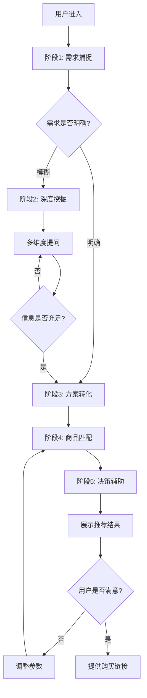

# AI定制购物向导 - 技术方案文档

## 一、产品概述
**AI定制购物向导** 是一个基于对话式AI的智能导购系统，采用"需求优先"（Need-First）而非"商品优先"（Product-First）的设计理念。系统通过多轮对话深度挖掘用户真实需求，提供顾问式购物建议，在充分分析后才提供购买链接，实现从"我想买什么"到"我要解决什么问题"的购物体验升级。

### 核心价值主张
| 用户角色 | 核心价值 |
| :--- | :--- |
| **消费者** | 减少选择困难，获得个性化解决方案，降低购买后悔率 |
| **电商平台** | 提升转化质量，减少退货率，建立差异化竞争优势 |
| **品牌商家** | 获得高质量流量，提升品牌信任度，实现精准营销 |

## 二、系统架构设计

### 2.1 整体架构图
```
┌─────────────────────────────────────────────────────────────┐
│                        用户交互层                              │
│  ┌──────────┐  ┌──────────┐  ┌──────────┐  ┌──────────┐   │
│  │ Web端    │  │ 移动App  │  │ 小程序    │  │ API接口   │   │
│  └──────────┘  └──────────┘  └──────────┘  └──────────┘   │
└───────────────────────────┬─────────────────────────────────┘
                            │
┌───────────────────────────▼─────────────────────────────────┐
│                      AI对话引擎层                              │
│  ┌────────────────────────────────────────────────────────┐ │
│  │  意图识别    │  实体提取    │  上下文管理  │  对话策略  │ │
│  └────────────────────────────────────────────────────────┘ │
└───────────────────────────┬─────────────────────────────────┘
                            │
┌───────────────────────────▼─────────────────────────────────┐
│                      业务逻辑层                                │
│  ┌──────────┐  ┌──────────┐  ┌──────────┐  ┌──────────┐   │
│  │需求建模  │  │方案生成  │  │商品匹配  │  │决策支持  │   │
│  │引擎      │  │引擎      │  │引擎      │  │引擎      │   │
│  └──────────┘  └──────────┘  └──────────┘  └──────────┘   │
└───────────────────────────┬─────────────────────────────────┘
                            │
┌───────────────────────────▼─────────────────────────────────┐
│                      数据服务层                                │
│  ┌──────────┐  ┌──────────┐  ┌──────────┐  ┌──────────┐   │
│  │商品数据库│  │用户画像  │  │知识图谱  │  │电商API   │   │
│  └──────────┘  └──────────┘  └──────────┘  └──────────┘   │
└─────────────────────────────────────────────────────────────┘
```

### 2.2 核心模块功能表
| 模块名称 | 主要功能 | 技术选型 | 优先级 |
| :--- | :--- | :--- | :--- |
| **对话管理** | 多轮对话控制、上下文维护 | LangChain + GPT-4 API | 高 |
| **需求建模** | 用户需求结构化、意图识别 | 自研规则引擎 + LLM | 高 |
| **商品检索** | 商品搜索、过滤、排序 | Elasticsearch + 电商API | 高 |
| **决策分析** | 优缺点分析、推荐理由生成 | LLM + 评论挖掘 | 中 |
| **用户画像** | 个性化偏好学习 | Redis + MySQL | 低 |

## 三、业务流程设计

### 3.1 五阶段交互流程


### 3.2 详细阶段分解表
| 阶段 | 目标 | AI行为 | 用户行为 | 预计轮次 | 关键指标 |
| :--- | :--- | :--- | :--- | :--- | :--- |
| **需求捕捉** | 识别核心问题域 | 意图分类、实体提取 | 描述痛点/需求 | 1-2轮 | 意图识别准确率>90% |
| **深度挖掘** | 明确具体需求 | 结构化提问 | 回答细节问题 | 2-4轮 | 需求完整度>80% |
| **方案转化** | 生成解决方案 | 需求映射、类目匹配 | 确认理解正确性 | 1轮 | 方案相关性>85% |
| **商品匹配** | 检索候选商品 | 搜索、过滤、排序 | 浏览商品列表 | 1轮 | 商品匹配度>80% |
| **决策辅助** | 提供购买建议 | 生成分析报告 | 做出购买决策 | 1轮 | 转化率>15% |

## 四、关键技术方案

### 4.1 需求理解算法
采用**思维链推理（Chain of Thought）**方法，强制AI进行结构化分析：

```python
def analyze_user_need(user_input):
    """
    需求分析流程
    """
    # 步骤1: 提取症状
    symptoms = extract_symptoms(user_input)
    
    # 步骤2: 诊断问题类型
    problem_type = classify_problem(symptoms)
    
    # 步骤3: 生成解决方案
    solutions = generate_solutions(problem_type)
    
    # 步骤4: 映射商品类目
    categories = map_to_categories(solutions)
    
    return {
        'symptoms': symptoms,
        'problem_type': problem_type,
        'solutions': solutions,
        'categories': categories
    }
```

### 4.2 商品评分算法
综合评分公式：
$$ \text{Score} = w_1 \cdot \text{Relevance} + w_2 \cdot \text{Quality} + w_3 \cdot \text{Price} + w_4 \cdot \text{Preference} $$

| 维度 | 计算方法 | 权重建议 |
| :--- | :--- | :--- |
| **Relevance** | 需求向量与商品特征向量余弦相似度 | 0.4 |
| **Quality** | 评分×(1-差评率) | 0.3 |
| **Price** | 1 - abs(价格-预算中位数)/预算范围 | 0.2 |
| **Preference** | 用户历史偏好匹配度 | 0.1 |

### 4.3 优缺点分析技术方案
基于评论挖掘的客观分析：
1. **评论采集**: 爬虫 + API (电商平台评论区)
2. **情感分析**: BERT情感分类模型 (好评/中评/差评)
3. **关键词提取**: TF-IDF + 词频统计 (高频负面词汇)
4. **优缺点总结**: LLM文本生成 (结构化优缺点)

## 五、界面原型设计
(ASCII原型见设计文档)

## 六、数据模型设计

### 6.1 用户需求实体
```json
{
  "need_profile": {
    "session_id": "sess_20241227_001",
    "user_id": "user_12345",
    "raw_input": "最近睡眠不好，想买点帮助睡眠的东西",
    "extracted_entities": {
      "problem_domain": "sleep",
      "symptoms": ["睡眠质量差", "难入睡"],
      "explicit_products": ["眼罩", "枕头"],
      "implicit_needs": ["遮光", "降噪", "舒适支撑"]
    },
    "user_constraints": {
      "budget_range": [50, 300],
      "usage_scenario": "家庭卧室",
      "health_conditions": [],
      "brand_preferences": {
        "liked": [],
        "disliked": ["无名品牌"]
      }
    },
    "conversation_context": {
      "current_stage": "deep_inquiry",
      "completed_questions": ["problem_type", "budget"],
      "next_questions": ["usage_frequency", "material_preference"]
    }
  }
}
```

## 七、开发路线图
- **第1周**: 对话引擎搭建 (基础对话Demo)
- **第2周**: 需求分析模块 (需求提取功能)
- **第3周**: 商品匹配引擎 (推荐结果展示)
- **第4周**: 界面集成测试 (完整产品原型)

## 八、技术选型
- **后端**: FastAPI (Python)
- **前端**: React Native / Web
- **数据库**: PostgreSQL + Redis
- **搜索引擎**: Elasticsearch
